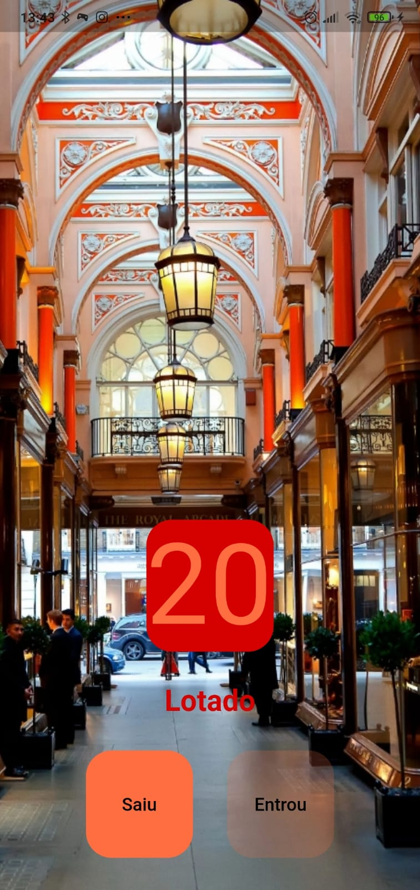

 

  

<h3 align="center">Controle de Pessoas</h3>

 

    App criado para praticar os primeiros conceitos sobre Flutter.
     
    Nesse projeto foi trabalhado os conceitos iniciais do Flutter como os widgets Columns, Rows, Text e TextButtom, além dos conceitos de <strong>Statefull widgets</strong> e <strong>Stateless widgets</strong>.
     
     
  

  ## 📝 Descrição do App:

 
    Este app foi desenvolvido visando o controle do fluxo de pessoas em uma exposição de artes em um determinado museu. Tendo em vista que a quantidade máxima permitida na sala de visitação é 20 pessoas o app apresenta um contador que vai de 0 (zero) à 20 (vinte), informando quando é permitido a entrada de mais visitantes e quando está lotado.
 
 

## 📱Demonstração: 

  
  

 
 

## ⬇️Download:

Caso queira baixar o app no seu celular, bastar executar o [arquivo](https://github.com/CaduConrado/Controle-de-Visitantes/tree/main/download) no seu celular.

## 😊Obrigado!

Obrigado pelo interesse em conhecer esse meu projeto, se você gostou fique a vontade para lhe dar uma estrela! ⭐🤗